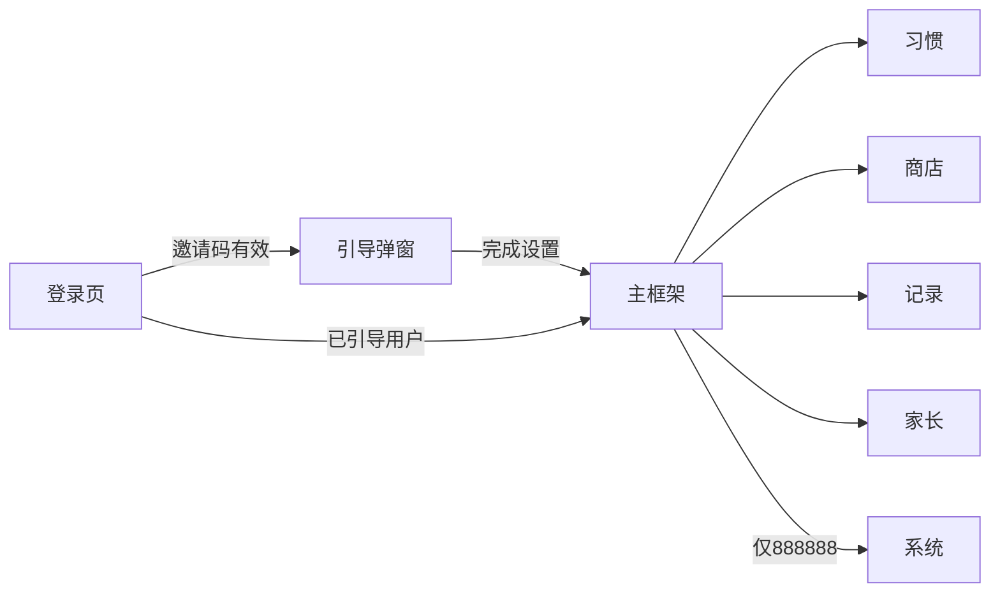

# 习惯小达人（ChildrenGood）项目说明文档

本文档描述当前 Web 产品的功能、样式、数据存储与接口，供后续基于微信小程序模板复刻时使用。

---

## 1. 项目概述

- **产品名称**：习惯小达人（ChildrenGood）
- **技术栈**：React 19 + TypeScript + Vite；Tailwind CSS；Zustand（持久化到 localStorage）；Express + SQLite 后端
- **核心价值**：儿童习惯打卡（星星评分）+ 积分兑换奖励；多用户通过邀请码登录；可选云端同步（按用户开关）

---

## 2. 功能说明（按模块）

| 模块 | 功能要点 | 对应组件/入口 |
|------|----------|----------------|
| **登录** | 邀请码登录；先请求服务端 `POST /api/login`，失败则本地校验初始码 888888 | `src/components/LoginPage.tsx` |
| **引导/Onboarding** | 首次使用弹窗：选择性别 → 选择年龄段（3–6 / 7–12 / 13–16）→ 根据推荐生成习惯与奖励 | `src/components/OnboardingModal.tsx`、`src/data/recommendations.ts` |
| **习惯页** | 习惯卡片网格；每卡可打星（1~maxStars）；当日重复打分会更新并计算积分差；满分显示皇冠 | `HabitCard.tsx`、`StarRating.tsx`；当日积分记录 `ScoreHistory.tsx` |
| **奖励页** | 奖励卡片网格；显示所需积分；积分足够可兑换，扣积分并记 RewardLog | `RewardCard.tsx`、`RewardHistory.tsx` |
| **历史页** | 按日期查看积分记录（ScoreHistory）；日期切换、日期选择器 | `HistoryPage.tsx`、`CustomDatePicker.tsx` |
| **家长/Admin** | 管理习惯（增删、设置每习惯 maxStars）；管理奖励（增删、设置 cost）；登出；重置全部（清空本地并刷新） | `Admin.tsx` |
| **系统/System** | 仅根管理员 888888 可见：创建/删除邀请码、开关「跨设备同步」、调试工具（加积分、重置今日打卡、重置全部） | `SystemAdminPage.tsx` |

**导航与权限**：

- **底部 Tab 导航**：习惯 / 商店 / 记录 / 家长 / 系统（系统 Tab 仅 888888 可见）
- **权限**：所有登录用户可进「家长」；仅邀请码 888888 可进「系统」

---

## 3. 页面与流程

**流程简述**：

- 未登录 → 登录页
- 已登录且未完成引导 → Onboarding 弹窗（性别 → 年龄段 → 生成习惯与奖励）
- 已登录且已引导 → 主框架（Header + 内容区 + 底部 Tab）

**主框架**：

- 固定顶栏：Logo + 当前积分
- 主内容区随 Tab 切换（习惯 / 商店 / 记录 / 家长 / 系统）
- 底部胶囊导航（居中、圆角、毛玻璃）；底部版本号 v1.1

---

## 4. 样式与设计规范（便于小程序复刻）

### 4.1 品牌色

| 名称 | 色值 | 用途示例 |
|------|------|----------|
| brand-yellow | #FFD93D | 星星、次要按钮、高亮 |
| brand-blue | #4D96FF | 主按钮、Tab 激活、链接 |
| brand-green | #6BCB77 | 成功、可兑换状态、开关开启 |
| brand-red | #FF6B6B | 危险、兑换扣分 |
| brand-background | #F7F9FC | 页面背景 |

### 4.2 字体与基础

- **字体**：Varela Round、Comic Sans MS、Chalkboard SE（儿童友好）；正文灰 `#1F2937`，背景 `#F7F9FC`
- **body**：`background-color: #F7F9FC`，`color: #1F2937`

### 4.3 通用 UI 约定

- **卡片**：白底、圆角 `rounded-3xl`（约 24px）、阴影 `shadow-xl`、底部粗边 `border-b-4 border-gray-100`
- **按钮**：圆角 `rounded-2xl`；变体：primary=蓝、secondary=黄、danger=红、ghost=透明灰
- **习惯卡片图标区**：方形容器（如 64×64）、圆角、Tailwind 颜色类（如 `bg-blue-500`），图标为 Lucide 名
- **底部导航**：白底 90% 透明 + 毛玻璃、圆角全角胶囊、激活态略上移（translateY -4px）+ 灰底/蓝字

### 4.4 动效

- 使用 Framer Motion：卡片入场 opacity + y/scale；按钮 tap scale 0.95；星星点击 scale
- 小程序可改为 CSS 动画或 WXSS transition

### 4.5 图标清单（Lucide 名称 → 小程序映射）

当前使用 Lucide 按名称渲染；以下为项目中出现的全部 icon 名称，便于小程序换成 iconfont 或本地图标集。

**UI 固定用法**：Rocket, Star, Gift, CircleCheck, Calendar, Settings, Shield, Crown, Ghost, ChevronLeft, ChevronRight, ListTodo, Trash2, LogOut, TrendingUp, Minus, History, Brain, Sparkles, Wrench, Users, AlertTriangle（组件内写 AlertTriangle，Icon 内部映射为 TriangleAlert）, Gift（ConfirmModal 默认 icon 可传）  

**习惯/奖励数据中的 icon（来自 CSV 或默认）**：

- 习惯：Sun, Smile, Shirt, Utensils, Moon, Brain, Languages, GraduationCap, Box, Scroll, Home, Heart, Calculator, Book, Briefcase, PenTool, Clock, SmartphoneOff, Dumbbell
- 奖励：Star, IceCream, Tv, Moon, FerrisWheel, BookOpen, Palette, ShoppingCart, Puzzle, Ticket, PartyPopper, Banknote, Users, Headphones, Ghost

**Icon 组件别名**：HelpCircle → CircleHelp；CheckCircle2 → CircleCheck；AlertTriangle → TriangleAlert。

---

## 5. 数据模型与存储

### 5.1 前端类型（`src/types/index.ts`）

| 类型 | 字段 |
|------|------|
| **Habit** | id, title, icon, color, maxStars |
| **Reward** | id, title, cost, icon |
| **HabitLog** | id, habitId, date (YYYY-MM-DD), stars, timestamp |
| **RewardLog** | id, rewardId, rewardTitle, rewardIcon?, cost, date, timestamp |
| **ScoreLog** | id, source, type: 'habit' \| 'reward' \| 'manual', delta, timestamp, date |
| **User** | id, name, role, code, allowSync? |
| **InvitationCode** | code, name, role, allowSync?, createdAt |

**UserData**（按用户一份）：habits, rewards, logs, rewardLogs, scoreLogs, score, isSetup?, childProfile?: { ageGroup, gender }

### 5.2 前端持久化（`src/store/useStore.ts`）

- **库**：Zustand + `persist`，storage：`localStorage`，key：`habit-builder-storage`
- **按用户隔离**：`userData: Record<userId, UserData>`；当前用户登录后从 `userData[userId]` 载入到顶层 habits/rewards/logs/score/…
- **写入**：任何修改在内存更新后通过 `syncToUser` 写回 `userData[userId]`；若该用户 `allowSync === true`，同时 `POST /api/data/:code` 同步服务端

### 5.3 服务端（`server/database.js`、`server/index.js`）

- **数据库**：SQLite，单文件 `server/database.sqlite`
- **表**：`users`（code PK, name, role, data TEXT, created_at, allow_sync）
  - `data`：单个 JSON 大字段，与前端 UserData 结构一致
- **初始数据**：若不存在 code=888888，则插入一条默认管理员（name=家长，allow_sync=1）

**同步策略**：

- allowSync 为 true 时：登录拉取服务端 `data` 作为该用户数据；本地修改后 POST 覆盖服务端 `data`
- **冲突**：当前实现为「最后写入覆盖」，不做多端合并

---

## 6. API 接口（供小程序对接或自建后端）

| 方法 | 路径 | 请求体/说明 | 响应 |
|------|------|-------------|------|
| POST | /api/login | Body: `{ code }` | `{ success, user: { id, name, role, code, allowSync }, data: UserData }` |
| POST | /api/data/:code | Body: `{ data }`；需该用户 allow_sync | `{ success }` |
| POST | /api/invite/create | Body: `{ adminCode, name, role, allowSync }` | `{ success, code }` |
| GET | /api/invites | - | `{ invites: [] }` |
| POST | /api/invite/delete | Body: `{ targetCode }` | `{ success }` |
| POST | /api/invite/toggle-sync | Body: `{ targetCode, allowSync }` | `{ success }` |

**说明**：创建邀请码时服务端未校验 adminCode（仅前端限制）；删除时禁止删除 888888。

---

## 7. 微信小程序迁移要点

- **页面映射**：登录页 → 登录页；Onboarding → 弹窗或独立引导页；主框架 → 自定义 TabBar + 多个页面（习惯/商店/记录/家长/系统）
- **状态与存储**：Zustand 改为小程序全局 Store（如 mobx-miniprogram 或自建）+ 持久化用 `wx.setStorageSync('habit-builder-storage', ...)`，结构与现有 `userData` 一致
- **请求**：用 `wx.request` 封装上述 API，配置域名白名单与 HTTPS
- **图标**：用 iconfont 或本地 PNG/SVG 替代 Lucide，按第 4.5 节 icon 名称做映射表
- **样式**：用 rpx 与 WXSS 变量复刻品牌色、圆角、阴影；底部 Tab 用 custom-tab-bar 实现胶囊样式
- **日期**：date-fns 改为小程序兼容实现（yyyy-MM-dd 与中文展示，如「M月d日」「EEEE」）
